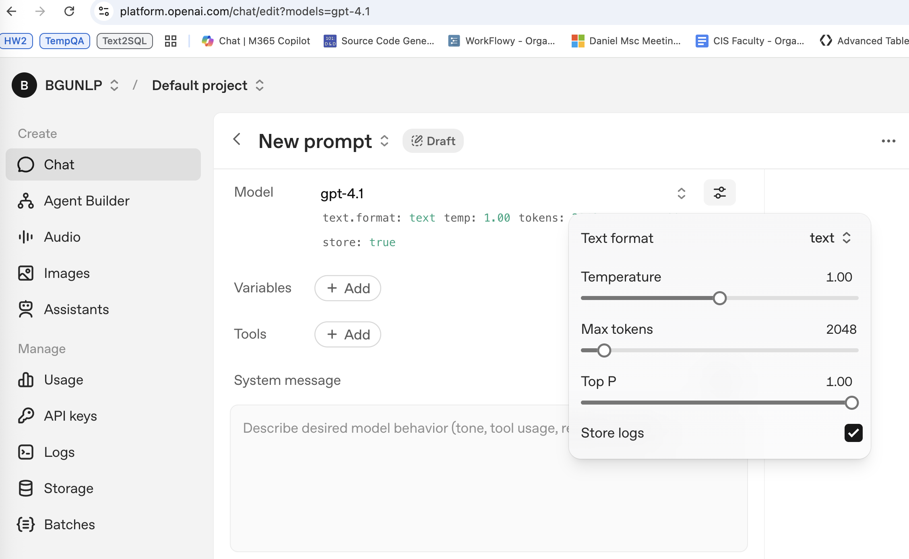

---
tags:
  - LLM
  - Decoding
  - Sampling
course: LLM-SE 2026
semester: Fall 2026
---

## Decoding Strategies for Language Models

A LM computes a probability distribution over a set of tokens (the vocabulary of the LM) given a prefix (a sequence of tokens).

To generate text (as opposed to a single token), we need to compute a sequence of tokens in auto-regressive manner, that is, given a prefix $(p_1, \dots, p_k)$ we generate the first token, $t_1$ then, given $(p_1, \dots, p_n, t_1)$, we sample the next token $t_2$, and continue until we reach a special token $[EOS]$ which indicates "end of sequence".

The **greedy generation** method consists of selecting the highest probability token from the LM distribution at each step.  This method does not insure that the generated sequence has the highest probability (as a high probability first token $t_1$ can hide other good options that would have occurred if a different path $t_1' \dots t_k'$ had been selected).  

<https://huggingface.co/blog/how-to-generate> (Von Platen 2020)
This blog provides practical explanations on how to decode a sequence of tokens given a prompt from a LM.  It compares the following decoding strategies:

- Greedy
- Beam-search
- The temperature parameter
- Top-p (nucleus sampling)
- Top-N

It provides short Python code examples using the huggingface transformers library.

The parameters related to decoding are usually made available when using LLMs through a public API (most frequently top-p, temperature).

**Speculative Decoding** has been introduced in 2023 and allows significant speed-up of the decoding process by estimating the relative difficulty of predicting different tokens in the generated sequence and delegating "easy tokens" to a fast-and-cheap LLM.  It is the algorithm most currently used in production.

### Decoding Strategies References

| The Curious Case of Neural Text Degeneration                                                                                                                                                                                                                                                                                                                                                                                                                                                                                                                                                                                                                                                                                                                                                                                                                                                                                                                                                                                                                                                                                                                                           |
| -------------------------------------------------------------------------------------------------------------------------------------------------------------------------------------------------------------------------------------------------------------------------------------------------------------------------------------------------------------------------------------------------------------------------------------------------------------------------------------------------------------------------------------------------------------------------------------------------------------------------------------------------------------------------------------------------------------------------------------------------------------------------------------------------------------------------------------------------------------------------------------------------------------------------------------------------------------------------------------------------------------------------------------------------------------------------------------------------------------------------------------------------------------------------------------- |
| Holtzman et al 2020                                                                                                                                                                                                                                                                                                                                                                                                                                                                                                                                                                                                                                                                                                                                                                                                                                                                                                                                                                                                                                                                                                                                                                    |
| <https://arxiv.org/abs/1904.09751>                                                                                                                                                                                                                                                                                                                                                                                                                                                                                                                                                                                                                                                                                                                                                                                                                                                                                                                                                                                                                                                                                                                                                     |
| Despite considerable advancements with deep neural language models, the enigma of neural text degeneration persists when these models are tested as text generators. The counter-intuitive empirical observation is that even though the use of likelihood as training objective leads to high quality models for a broad range of language understanding tasks, using likelihood as a decoding objective leads to text that is bland and strangely repetitive. In this paper, we reveal surprising distributional differences between human text and machine text. In addition, we find that decoding strategies alone can dramatically effect the quality of machine text, even when generated from exactly the same neural language model. Our findings motivate Nucleus Sampling, a simple but effective method to draw the best out of neural generation. By sampling text from the dynamic nucleus of the probability distribution, which allows for diversity while effectively truncating the less reliable tail of the distribution, the resulting text better demonstrates the quality of human text, yielding enhanced diversity without sacrificing fluency and coherence. |

| If beam search is the answer, what was the question?                                                                                                                                                                                                                                                                                                                                                                                                                                                                                                                                                                                                                                                                                                                                                                                                                                                                                                                                                                                                                                                                                                                                                                               |
| ---------------------------------------------------------------------------------------------------------------------------------------------------------------------------------------------------------------------------------------------------------------------------------------------------------------------------------------------------------------------------------------------------------------------------------------------------------------------------------------------------------------------------------------------------------------------------------------------------------------------------------------------------------------------------------------------------------------------------------------------------------------------------------------------------------------------------------------------------------------------------------------------------------------------------------------------------------------------------------------------------------------------------------------------------------------------------------------------------------------------------------------------------------------------------------------------------------------------------------- |
| Meister et al 2020                                                                                                                                                                                                                                                                                                                                                                                                                                                                                                                                                                                                                                                                                                                                                                                                                                                                                                                                                                                                                                                                                                                                                                                                                 |
| <https://arxiv.org/abs/2010.02650>                                                                                                                                                                                                                                                                                                                                                                                                                                                                                                                                                                                                                                                                                                                                                                                                                                                                                                                                                                                                                                                                                                                                                                                                 |
| Quite surprisingly, exact maximum a posteriori (MAP) decoding of neural language generators frequently leads to low-quality results. Rather, most state-of-the-art results on language generation tasks are attained using beam search despite its overwhelmingly high search error rate. This implies that the MAP objective alone does not express the properties we desire in text, which merits the question: if beam search is the answer, what was the question? We frame beam search as the exact solution to a different decoding objective in order to gain insights into why high probability under a model alone may not indicate adequacy. We find that beam search enforces uniform information density in text, a property motivated by cognitive science. We suggest a set of decoding objectives that explicitly enforce this property and find that exact decoding with these objectives alleviates the problems encountered when decoding poorly calibrated language generation models. Additionally, we analyze the text produced using various decoding strategies and see that, in our neural machine translation experiments, the extent to which this property is adhered to strongly correlates with BLEU. |

| A Non-monotonic Self-terminating Language Model |
| --------------- |
| Choi et al 2022 |
| <https://arxiv.org/abs/2210.00660> |
| Recent large-scale neural autoregressive sequence models have shown impressive performances on a variety of natural language generation tasks. However, their generated sequences often exhibit degenerate properties such as non-termination, undesirable repetition, and premature termination, when generated with decoding algorithms such as greedy search, beam search, top-k sampling, and nucleus sampling. In this paper, we focus on the problem of non-terminating sequences resulting from an incomplete decoding algorithm. We first define an incomplete probable decoding algorithm which includes greedy search, top-k sampling, and nucleus sampling, beyond the incomplete decoding algorithm originally put forward by Welleck et al. (2020). We then propose a non-monotonic self-terminating language model, which significantly relaxes the constraint of monotonically increasing termination probability in the originally proposed self-terminating language model by Welleck et al. (2020), to address the issue of non-terminating sequences when using incomplete probable decoding algorithms. We prove that our proposed model prevents non-terminating sequences when using not only incomplete probable decoding algorithms but also beam search. We empirically validate our model on sequence completion tasks with various architectures. |

| Neural Text Generation with Unlikelihood Training |
| -------------- |
| Welleck et al, ICLR 2020 |
| <https://www.semanticscholar.org/paper/Neural-Text-Generation-with-Unlikelihood-Training-Welleck-Kulikov/53a77e8f73f2ca422d6e38fa9ecc490231ac044c> |
| Neural text generation is a key tool in natural language applications, but it is well known there are major problems at its core. In particular, standard likelihood training and decoding leads to dull and repetitive outputs. While some post-hoc fixes have been proposed, in particular top-$k$ and nucleus sampling, they do not address the fact that the token-level probabilities predicted by the model are poor. In this paper we show that the likelihood objective itself is at fault, resulting in a model that assigns too much probability to sequences containing repeats and frequent words, unlike those from the human training distribution. We propose a new objective, unlikelihood training, which forces unlikely generations to be assigned lower probability by the model. We show that both token and sequence level unlikelihood training give less repetitive, less dull text while maintaining perplexity, giving superior generations using standard greedy or beam search. According to human evaluations, our approach with standard beam search also outperforms the currently popular decoding methods of nucleus sampling or beam blocking, thus providing a strong alternative to existing techniques. |

| Truncation Sampling as Language Model Desmoothing                                                                                                                                                                                                                                                                                                                                                                                                                                                                                                                                                                                                                                                                                                                                                                                                                                                                                                                                                                                                                                                                                   |
| ----------------------------------------------------------------------------------------------------------------------------------------------------------------------------------------------------------------------------------------------------------------------------------------------------------------------------------------------------------------------------------------------------------------------------------------------------------------------------------------------------------------------------------------------------------------------------------------------------------------------------------------------------------------------------------------------------------------------------------------------------------------------------------------------------------------------------------------------------------------------------------------------------------------------------------------------------------------------------------------------------------------------------------------------------------------------------------------------------------------------------------- |
| John Hewitt, Christopher D. Manning, Percy Liang, EMNLP 2022                                                                                                                                                                                                                                                                                                                                                                                                                                                                                                                                                                                                                                                                                                                                                                                                                                                                                                                                                                                                                                                                        |
| <https://www.semanticscholar.org/paper/Truncation-Sampling-as-Language-Model-Desmoothing-Hewitt-Manning/21f0b7d4d4163e7a06fb420599b586958e9168a3>                                                                                                                                                                                                                                                                                                                                                                                                                                                                                                                                                                                                                                                                                                                                                                                                                                                                                                                                                                                   |
| Long samples of text from neural language models can be of poor quality. Truncation sampling algorithms--like top-$p$ or top-$k$ -- address this by setting some words' probabilities to zero at each step. This work provides framing for the aim of truncation, and an improved algorithm for that aim. We propose thinking of a neural language model as a mixture of a true distribution and a smoothing distribution that avoids infinite perplexity. In this light, truncation algorithms aim to perform desmoothing, estimating a subset of the support of the true distribution. Finding a good subset is crucial: we show that top-$p$ unnecessarily truncates high-probability words, for example causing it to truncate all words but Trump for a document that starts with Donald. We introduce $\eta$-sampling, which truncates words below an entropy-dependent probability threshold. Compared to previous algorithms, $\eta$-sampling generates more plausible long English documents according to humans, is better at breaking out of repetition, and behaves more reasonably on a battery of test distributions. |

**Fast Inference from Transformers via Speculative Decoding**
[Yaniv Leviathan](https://arxiv.org/search/cs?searchtype=author&query=Leviathan,+Y), [Matan Kalman](https://arxiv.org/search/cs?searchtype=author&query=Kalman,+M), [Yossi Matias](https://arxiv.org/search/cs?searchtype=author&query=Matias,+Y), ICML 2023
https://arxiv.org/abs/2211.17192
> Inference from large autoregressive models like Transformers is slow - decoding K tokens takes K serial runs of the model. In this work we introduce speculative decoding - an algorithm to sample from autoregressive models faster without any changes to the outputs, by computing several tokens in parallel. At the heart of our approach lie the observations that (1) hard language-modeling tasks often include easier subtasks that can be approximated well by more efficient models, and (2) using speculative execution and a novel sampling method, we can make exact decoding from the large models faster, by running them in parallel on the outputs of the approximation models, potentially generating several tokens concurrently, and without changing the distribution. Our method can accelerate existing off-the-shelf models without retraining or architecture changes. We demonstrate it on T5-XXL and show a 2X-3X acceleration compared to the standard T5X implementation, with identical outputs.