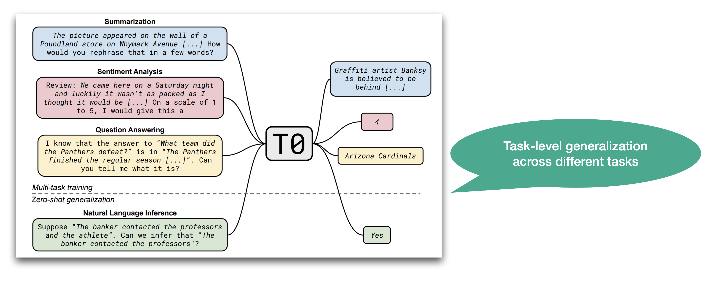

---
tags:
  - LLM
  - Pretraining
  - Finetuning
course: LLM-SE 2026
semester: Fall 2026
---
Current LLMs start from a transformer-based trained Language Model and include additional training rounds using different techniques, data sources and objectives.
### Pre-training

Language Model training (using transformers) in this context is called **pre-training**.
In a general manner, pre-training consists of training a model on self-supervised tasks and then re-using the resulting pre-trained model to solve downstream tasks.
#### Self-supervision

Pre-training is based on self-supervision: in the case of text, self-supervision consists of defining text-related tasks that do not require manual annotation, and instead rely only on observable text data. Such tasks include next-word prediction, masked-word prediction, and perturbation removal. The advantage of self-supervision is that raw text is abundant, while annotated data is scarce and expensive to collect.

Yet, self-supervised text tasks are informative enough to provide surprisingly general linguistic knowledge to language models.
#### Fine-tuning

Fine-tuning consists of training a model that has been pre-trained in a supervised (discriminative) manner on a relatively small supervised dataset. Different techniques have been developed to perform this task adaptation from the pre-training task to the fine-tuning task: mixture models, adapters, frozen/updated pre-trained layers.

The new task is analyzed with a labeled dataset $C$, where each instance consists of a sequence of input tokens, ($x_1, \dots , x_m$), and a label $y$. The advantages of fine-tuning compared to supervised learning from scratch on $C$ are that:

- One can obtain good predictive performance after pre-training with less labeled data than when training from scratch on the labeled task ([Howard and Ruder 2018] report that a model fine-tuned on 100 labeled examples does as well as one trained from scratch on 10,000 examples),
- One can fine-tune and adapt the same pre-trained model to multiple downstream tasks (yielding a multi-task model). [Howard and Ruder 2018] report fine-tuning on 6 tasks with a single model (ULMFit). Later models report fine-tuning on up to 2,000 tasks on a single model.

In [Radford et al, 2018], fine-tuning uses a mixture of the task-specific objective with the next-word prediction objective: The inputs are encoded using the pre-trained model. The encoding corresponds to the final transformer block's activation $h^m_l$.
This encoding is then passed into an additional separate linear output layer with parameters $W_y$ to predict $y$:

$p(y | x_1, \dots , x_m) = softmax(h^m_l W_y)$

The task-adaptation objective is to maximize:

$L_2(C) = \Sigma_(x,y){log P(y|x_1, \dots , x_m)}$

Fine-tuning optimizes the mixture objective (with weight $\lambda$) which combines the original next word prediction on the training dataset $C$ and the labeled task objective:

$L_3(C) = L_2(C) + \lambda \times L_1(C)$

## Multi-task Models

In ULMFiT [Howard and Ruder, ACL 2018] explored the potential to use fine-tuning of a single model to achieve multi-task performance. They demonstrated that fine-tuning a single model on six distinct tasks reached state of the art on all of them with 100 times less training data than was used on previous single-task models.

The T5 approach [Raffel et al, 2020] extended the analysis of multi-tasking by fine-tuning on more downstream tasks (the 11 tasks of the GLUE benchmark [Wang et al, 2019 ICLR](https://openreview.net/pdf?id=rJ4km2R5t7), the 10 additional tasks of the SuperGLUE benchmark [Wang et al, 2019 NeurIPS](https://w4ngatang.github.io/static/papers/superglue.pdf), CNN/DailyMail absractive summarization, SQuAD question-answering, WMT machine translation for English, German, French and Romanian pairs).  The model addresses more tasks, but also a more diverse set of tasks, beyond classification, including complex text to text transformations (abstractive summarization and machine translation).

Another innovation of the T5 approach was to introduce a common uniform text-to-text format to encode all of the downstream tasks, including classification, QA, and span identification (such as reference resolution). The benefit of this approach is that a single uniform cross-entropy loss is used for all tasks. Different tasks at training time by prefixing the sample data with a task description prefix. This prefix is similar to the usage of prompting in zero-shot learning that emerged in later work.

This is a typical representation of how a task is encoded in this format (from [Brown et al 2020]):

The T5 experiments demonstrated that multi-task performance using fine-tuning is achievable only after a certain scale is reached: both in terms of number of parameters in the model, but also in the size of the training data. The authors introduced the C4 dataset, which is a clean curation of Web material with a scale of approximately 100 that of Wikipedia. Experiments report performance on 32 tasks for model sizes ranging from 220M to 11Bn parameters. The largest model T5-11b reported new state of the art results  for 26 tasks.

The following diagram illustrates this cross-task generalization (from [Sanh et al 2022]):

Multi-task training has since then kept up with increasingly larger number of tasks:

- 6 tasks in ULMFit [Howard and Ruder ACL 2018]
- 25 tasks in T5 [Raffel et al JMLR 2020]
- 21 tasks in UnifiedSKG [Xie et al, 2022]: these are heterogeneous structured knowledge tasks that are all formulated in text to text format and benchmarked on T5 of different sizes with multi-task prefix tuning - show that T0, GPT-3 and Codex do not well on this dataset.
- 50 tasks in T0+ and CT0 [Scialom et al 2022]
- 60 tasks in T0 [Sanh et al 2022]
- 61 in NaturalInstructions [Mishra et al 2022](<https://arxiv.org/abs/2104.08773>) ACL-2022
- 1,600 tasks in SuperNaturalInstructions and Tk-Instruct [Wang et al 2022](<https://arxiv.org/pdf/2204.07705.pdf>)
- 1,800 in FLAN  [Chung et al 2022](<https://arxiv.org/abs/2210.11416>) Oct 2022 
- 2,000 tasks in *OPT-IML : Scaling Language Model Instruction Meta Learning through the Lens of Generalization* OPT-IML [Iyer et al, Dec 2022](<https://arxiv.org/pdf/2212.12017.pdf> ) (collects tasks from 8 existing benchmarks - including SuperNaturalInstructions, FLAN, UnifiedSKG, PromptSource).

### LORA Fine-tuning

Most current fine-tuning in LLMs uses the LORA method.
LoRA (Low-Rank Adaptation) is a **parameter-efficient fine-tuning**  (PEFT) method that modifies LLMs without retraining the entire model. It works by freezing the original LLM weights and injecting small, trainable "low-rank" matrices into specific layers. These new, smaller matrices are updated during fine-tuning, allowing the model to adapt to new tasks with significantly fewer computational resources and less time compared to full fine-tuning. 

[LoRA: Low-Rank Adaptation of Large Language Models](https://arxiv.org/abs/2106.09685) (2021)

#### How it works 

- **Freeze the base model:** LoRA keeps the original, pre-trained LLM weights frozen. This saves computational cost and prevents the model from "forgetting" what it already knows (the phenomenon is called *catastrophic forgetting* and has prevented multitask learning in the past).
- **Inject low-rank matrices:** Small, trainable matrices are added to certain layers (like the self-attention layers) of the model.
- **Train only the new matrices:** During fine-tuning, only the weights in these new, low-rank matrices are updated.
- **Combine for inference:** For new predictions, the output of these small matrices is added to the output of the original, frozen weight matrices. This is mathematically represented as the original weight matrix plus the product of the two smaller matrices $W_{original}+B \times A$. 
  The dimensions of the smaller matrices are chosen so that their multiplication results in a matrix the size of the original layer, effectively "adapting" the weights without changing the original ones. 

#### Benefits of LoRA 

- **Efficiency:** reduces the number of trainable parameters, making fine-tuning faster and requiring less memory and computing power.
- **Cost-effective:** Lower computational needs make fine-tuning accessible to more users.
- **Performance:** It can achieve performance comparable to or even better than full fine-tuning, particularly because the base model's knowledge remains intact.
- **Flexibility:** Different LoRA adapters can be trained for different tasks and swapped in and out of the same base model without needing to store multiple full copies of the LLM.

### Instruction Fine-tuning

The notion of **instruction fine-tuning** was introduced in the 2021 paper [Finetuned Language Models Are Zero-Shot Learners](https://arxiv.org/abs/2109.01652) which introduced the FLAN family of models. A parallel effort by OpenAI introduced the InstructGPT model in Mar 2022.

The work demonstrated that by fine-tuning a pre-trained language model on a diverse collection of existing NLP tasks all described using natural language instructions, the model (which they called FLAN) could effectively **generalize to perform unseen tasks in a zero-shot manner**. This approach substantially improved performance compared to the original pre-trained model and even outperformed zero-shot GPT-3 on many tasks at the time. 

This means that after learning to perform about 2,000 tasks $(T_1, ..., T_n)$ on supervised data using labels of the form *(task instruction, input, label)*, the model generalizes to perform well on a new type of task $T_{n+1}$ which is described just by the textual instruction.

**Training language models to follow instructions with human feedback**
Ouyang et al (OpenAI), Mar 2022 InstructGPT 
<https://arxiv.org/abs/2203.02155>
> Making language models bigger does not inherently make them better at following a user's intent. For example, large language models can generate outputs that are untruthful, toxic, or simply not helpful to the user. In other words, these models are not aligned with their users. In this paper, we show an avenue for aligning language models with user intent on a wide range of tasks by fine-tuning with human feedback. Starting with a set of labeler-written prompts and prompts submitted through the OpenAI API, we collect a dataset of labeler demonstrations of the desired model behavior, which we use to fine-tune GPT-3 using supervised learning. We then collect a dataset of rankings of model outputs, which we use to further fine-tune this supervised model using reinforcement learning from human feedback. We call the resulting models InstructGPT. In human evaluations on our prompt distribution, outputs from the 1.3B parameter InstructGPT model are preferred to outputs from the 175B GPT-3, despite having 100x fewer parameters. Moreover, InstructGPT models show improvements in truthfulness and reductions in toxic output generation while having minimal performance regressions on public NLP datasets. Even though InstructGPT still makes simple mistakes, our results show that fine-tuning with human feedback is a promising direction for aligning language models with human intent.

**Scaling Instruction-Finetuned Language Models**
Chung et al, Oct 2022 FLAN
<https://arxiv.org/abs/2210.11416>  
> Finetuning language models on a collection of datasets phrased as instructions has been shown to improve model performance and generalization to unseen tasks. In this paper we explore instruction finetuning with a particular focus on (1) scaling the number of tasks, (2) scaling the model size, and (3) finetuning on chain-of-thought data. We find that instruction finetuning with the above aspects dramatically improves performance on a variety of model classes (PaLM, T5, U-PaLM), prompting setups (zero-shot, few-shot, CoT), and evaluation benchmarks (MMLU, BBH, TyDiQA, MGSM, open-ended generation). For instance, Flan-PaLM 540B instruction-finetuned on 1.8K tasks outperforms PALM 540B by a large margin (+9.4% on average). Flan-PaLM 540B achieves state-of-the-art performance on several benchmarks, such as 75.2% on five-shot MMLU. We also publicly release Flan-T5 checkpoints, which achieve strong few-shot performance even compared to much larger models, such as PaLM 62B. Overall, instruction finetuning is a general method for improving the performance and usability of pretrained language models.

**SUPER-NATURALINSTRUCTIONS: Generalization via Declarative Instructions on 1600+ NLP Tasks**
<https://arxiv.org/pdf/2204.07705.pdf>
Wang *et al* Oct 2022
- [Slides](https://danielkhashabi.com/files/2022_super_natural_instructions/nvidia-superni-talk.pdf)
- [20 mn presentation](https://www.youtube.com/watch?v=EoYpO_ECD6M)
> Scale up Flan and T0 to fine-tune a LLM on more tasks - 1,600 tasks (as opposed to 400 in Flan). With 11B params - they beat GPT-3 with instructions training (175B params) on their test data. Number of tasks helps more than scaling up the LLM - scaling up both is best.

