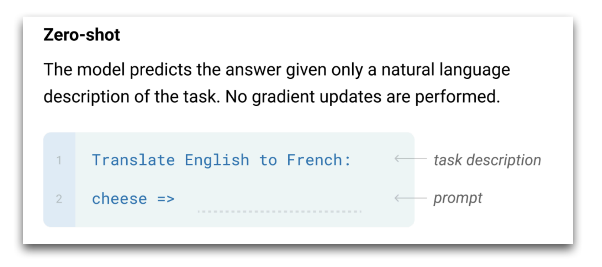
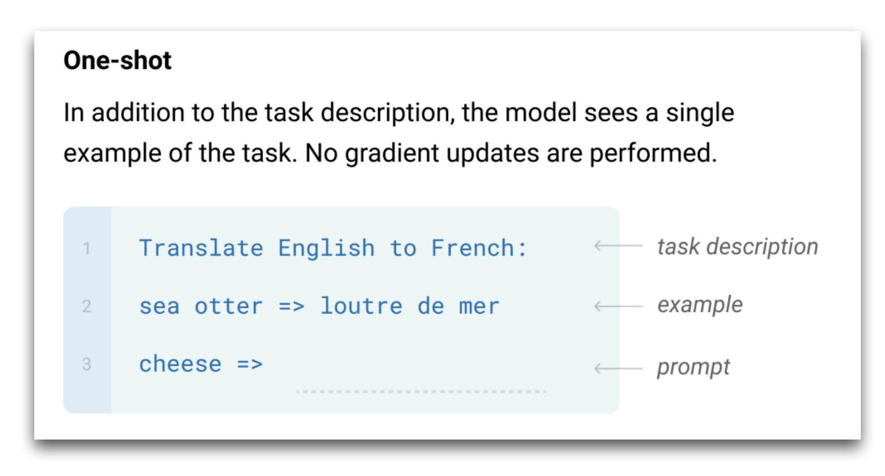
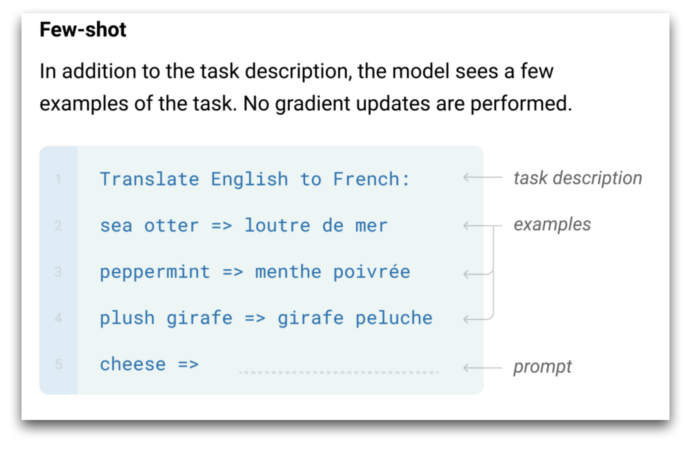

---
tags:
  - LLM
  - Prompting
course: LLM-SE 2026
semester: Fall 2026
---
Given a fully-trained LLM (instruction fine-tuned and post-trained for human preferences and reasoning patterns and tools usage), prompting strategies are algorithms used at inference-time (that is, these do not include training or weight-updates) to drive the process of generating an answer given a task.  The prompting strategies determine how to encode the task parameters into a prompt (or multiple prompts), which sampling parameters to use for decoding (see [03 LM Decoding Strategies and Parameters](03%20LM%20Decoding%20Strategies%20and%20Parameters.md)), and how to compute the final answer to the task at hand.  
Prompting strategies are implemented as libraries that invoke an underlying LLM API.
### Zero-shot / One-shot / Few-shot

## In-Context Learning

The few-shot prompting approach is surprising: it indicates that the LLM is capable of generalizing from a few examples.  But this generalization comes without weight update - it is performed completely at inference time, in contrast to previously known forms of machine learning.  This mechanism is known as *in-context learning* (ICL).

Research has indicated that the order of the examples, the selection of the examples has very high influence on the performance of the task.  In practice, we will use the method of *prompt optimization* to set these parameters given a small training dataset. 

Research also investigated the mechanism that enables in-context learning.  The following articles illustrate this trend (from 2022):

| What Can Transformers Learn In-Context? A Case Study of Simple Function Classes                                                                                                                                                                                                                                                                                                                                                                                                                                                                                                                                                                                                                                                                                                                                                                                                                                                                                                                                                                                                                                                                                                                                                                                                                                                                                                                                                                                                                                                                                                                                                                                                                                    |
| ------------------------------------------------------------------------------------------------------------------------------------------------------------------------------------------------------------------------------------------------------------------------------------------------------------------------------------------------------------------------------------------------------------------------------------------------------------------------------------------------------------------------------------------------------------------------------------------------------------------------------------------------------------------------------------------------------------------------------------------------------------------------------------------------------------------------------------------------------------------------------------------------------------------------------------------------------------------------------------------------------------------------------------------------------------------------------------------------------------------------------------------------------------------------------------------------------------------------------------------------------------------------------------------------------------------------------------------------------------------------------------------------------------------------------------------------------------------------------------------------------------------------------------------------------------------------------------------------------------------------------------------------------------------------------------------------------------------ |
| Shivam Garg, Dimitris Tsipras, Percy Liang, G. Valiant                                                                                                                                                                                                                                                                                                                                                                                                                                                                                                                                                                                                                                                                                                                                                                                                                                                                                                                                                                                                                                                                                                                                                                                                                                                                                                                                                                                                                                                                                                                                                                                                                                                             |
| <https://www.semanticscholar.org/paper/What-Can-Transformers-Learn-In-Context-A-Case-Study-Garg-Tsipras/f643aae4d8a8b17b7704fa310d3c15894806e9b3>                                                                                                                                                                                                                                                                                                                                                                                                                                                                                                                                                                                                                                                                                                                                                                                                                                                                                                                                                                                                                                                                                                                                                                                                                                                                                                                                                                                                                                                                                                                                                                  |
| Code <https://github.com/dtsip/in-context-learning>                                                                                                                                                                                                                                                                                                                                                                                                                                                                                                                                                                                                                                                                                                                                                                                                                                                                                                                                                                                                                                                                                                                                                                                                                                                                                                                                                                                                                                                                                                                                                                                                                                                                |
| In-context learning refers to the ability of a model to condition on a prompt sequence consisting of in-context examples (input-output pairs corresponding to some task) along with a new query input, and generate the corresponding output. Crucially, in-context learning happens only at inference time without any parameter updates to the model. While large language models such as GPT-3 exhibit some ability to perform in-context learning, it is unclear what the relationship is between tasks on which this succeeds and what is present in the training data. To make progress towards understanding in-context learning, we consider the well-defined problem of training a model to in-context learn a function class (e.g., linear functions): that is, given data derived from some functions in the class, can we train a model to in-context learn"most"functions from this class? We show empirically that standard Transformers can be trained from scratch to perform in-context learning of linear functions -- that is, the trained model is able to learn unseen linear functions from in-context examples with performance comparable to the optimal least squares estimator. In fact, in-context learning is possible even under two forms of distribution shift: (i) between the training data of the model and inference-time prompts, and (ii) between the in-context examples and the query input during inference. We also show that we can train Transformers to in-context learn more complex function classes -- namely sparse linear functions, two-layer neural networks, and decision trees -- with performance that matches or exceeds task-specific learning algorithms. |
| Percy Liang presentation: <https://www.youtube.com/watch?v=L8YHbVZlYuw>                                                                                                                                                                                                                                                                                                                                                                                                                                                                                                                                                                                                                                                                                                                                                                                                                                                                                                                                                                                                                                                                                                                                                                                                                                                                                                                                                                                                                                                                                                                                                                                                                                            |

| An Explanation of In-context Learning as Implicit Bayesian Inference                                                                                                                                                                                                                                                                                                                                                                                                                                                                                                                                                                                                                                                                                                                                                                                                                                                                                                                                                                                                                                                                                                                                                                                                                                                                                                                             |
| ------------------------------------------------------------------------------------------------------------------------------------------------------------------------------------------------------------------------------------------------------------------------------------------------------------------------------------------------------------------------------------------------------------------------------------------------------------------------------------------------------------------------------------------------------------------------------------------------------------------------------------------------------------------------------------------------------------------------------------------------------------------------------------------------------------------------------------------------------------------------------------------------------------------------------------------------------------------------------------------------------------------------------------------------------------------------------------------------------------------------------------------------------------------------------------------------------------------------------------------------------------------------------------------------------------------------------------------------------------------------------------------------ |
| Sang Michael Xie, Aditi Raghunathan, Percy Liang, Tengyu Ma. ICLR 2022                                                                                                                                                                                                                                                                                                                                                                                                                                                                                                                                                                                                                                                                                                                                                                                                                                                                                                                                                                                                                                                                                                                                                                                                                                                                                                                           |
| <https://www.semanticscholar.org/paper/An-Explanation-of-In-context-Learning-as-Implicit-Xie-Raghunathan/10bd4160b44803ada6a3d2e366c44b7e2a4ffe90>                                                                                                                                                                                                                                                                                                                                                                                                                                                                                                                                                                                                                                                                                                                                                                                                                                                                                                                                                                                                                                                                                                                                                                                                                                               |
| Large language models (LMs) such as GPT-3 have the surprising ability to do in-context learning, where the model learns to do a downstream task simply by conditioning on a prompt consisting of input-output examples. The LM learns from these examples without being explicitly pretrained to learn. Thus, it is unclear what enables in-context learning. In this paper, we study how in-context learning can emerge when pretraining documents have long-range coherence. Here, the LM must infer a latent document-level concept to generate coherent next tokens during pretraining. At test time, in-context learning occurs when the LM also infers a shared latent concept between examples in a prompt. We prove when this occurs despite a distribution mismatch between prompts and pretraining data in a setting where the pretraining distribution is a mixture of HMMs. In contrast to messy large-scale datasets used to train LMs capable of in-context learning, we generate a small-scale synthetic dataset (GINC) where Transformers and LSTMs both exhibit in-context learning. Beyond the theory, experiments on GINC exhibit large-scale real-world phenomena including improved in-context performance with model scaling (despite the same pretraining loss), sensitivity to example order, and instances where zero-shot is better than few-shot in-context learning. |
| Percy Liang presentation: <https://www.youtube.com/watch?v=L8YHbVZlYuw>                                                                                                                                                                                                                                                                                                                                                                                                                                                                                                                                                                                                                                                                                                                                                                                                                                                                                                                                                                                                                                                                                                                                                                                                                                                                                                                          |

| Rethinking the Role of Demonstrations: What Makes In-Context Learning Work?                                                                                                                                                                                                                                                                                                                                                                                                                                                                                                                                                                                                                                                                                                                                                                                                                                                                                                                                                                                                                                       |
| ----------------------------------------------------------------------------------------------------------------------------------------------------------------------------------------------------------------------------------------------------------------------------------------------------------------------------------------------------------------------------------------------------------------------------------------------------------------------------------------------------------------------------------------------------------------------------------------------------------------------------------------------------------------------------------------------------------------------------------------------------------------------------------------------------------------------------------------------------------------------------------------------------------------------------------------------------------------------------------------------------------------------------------------------------------------------------------------------------------------- |
| Sewon Min, Xinxi Lyu, Ari Holtzman, Mikel Artetxe, M. Lewis, Hannaneh Hajishirzi, Luke Zettlemoyer, EMNLP 2022                                                                                                                                                                                                                                                                                                                                                                                                                                                                                                                                                                                                                                                                                                                                                                                                                                                                                                                                                                                                    |
| <https://www.semanticscholar.org/paper/Rethinking-the-Role-of-Demonstrations%3A-What-Makes-Min-Lyu/87e02a265606f31e65986f3c1c448a3e3a3a066e>                                                                                                                                                                                                                                                                                                                                                                                                                                                                                                                                                                                                                                                                                                                                                                                                                                                                                                                                                                      |
| Large language models (LMs) are able to in-context learn—perform a new task via inference alone by conditioning on a few input-label pairs (demonstrations) and making predictions for new inputs. However, there has been little understanding of how the model learns and which aspects of the demonstrations contribute to end task performance. In this paper, we show that ground truth demonstrations are in fact not required—randomly replacing labels in the demonstrations barely hurts performance on a range of classification and multi-choce tasks, consistently over 12 different models including GPT-3. Instead, we find that other aspects of the demonstrations are the key drivers of endtask performance, including the fact that they provide a few examples of (1) the label space, (2) the distribution of the input text, and (3) the overall format of the sequence. Together, our analysis provides a new way of understanding how and why in-context learning works, while opening up new questions about how much can be learned from large language models through inference alone. |

## Complex Prompting

For complex tasks, it has been found that a single *prompt / answer* exchange with the LLM can be too limited.  One of the considerations to understand this point, is the computational complexity of transformers. Given a prompt of length $P$, the cost of generating an answer of length $A$ is $O((A+N)^2)$ (because the cost of a single token generation is dominated by the cost of cross-attention which is square of the length of the context).  For tasks that require more computation than this cost, it is unlikely that this approach will guess a correct answer, except if the length of the answer $A$ grows according to the complexity of the task.

Various strategies have been considered to decompose complex questions into multiple steps, that can then each be solved modularly:

- In **chain solutions**, the model is trained to generate a sequence of sub-questions at once given a complex question.  This is the approach used in the Chain of Thought (COT) and Program of Thought (POT) models.
- In **successive prompting**, the solution to a complex question is found by alternating two strategies - Question Decomposition (QD) and Question Answering (QA).  At each stage, the history of the previous stages is used as part of the prompt, so that the next sub-question generated by the model relies on the previous questions and their answers.  This leads to a "multi-turn" conversation between the LLM and the agent that seeks the answer.
- **Consistency** checking and **voting** patterns consist of running the same task multiple times through the LLM (often with adjustment to the temperature to encourage variability), and then by comparing the results obtained among the multiple candidates, one can decide which answer to eventually produce.  In some cases, the LLM can also be used to **verify** the answer before returning it.
- With **tool support**, a library of specialized modules is used to solve sub-tasks of different types through delegation to symbolic solvers (for arithmetic or logic problems), or with retrieval (with delegation to a retriever or search engine). The task of the LLM is to detect that a call to a tool is required, to select which tool to invoke, to parse from the context which parameters should be passed to the tool.  The tool is then invoked and the LLM continues parsing the output from the tool, merging it into the context, and continuing processing from this point.

### Chain of Thought

##### Scratchpads
*Show Your Work: Scratchpads for Intermediate Computation with Language Models*
Nye et al, Nov 2021
<https://arxiv.org/abs/2112.00114>
> Large pre-trained language models perform remarkably well on tasks that can be done "in one pass", such as generating realistic text or synthesizing computer programs. However, they struggle with tasks that require unbounded multi-step computation, such as adding integers or executing programs. Surprisingly, we find that these same models are able to perform complex multi-step computations -- even in the few-shot regime -- when asked to perform the operation "step by step", showing the results of intermediate computations. In particular, we train transformers to perform multi-step computations by asking them to emit intermediate computation steps into a "scratchpad". On a series of increasingly complex tasks ranging from long addition to the execution of arbitrary programs, we show that scratchpads dramatically improve the ability of language models to perform multi-step computations.

##### Chain of Thought (CoT)
*Chain of Thought Prompting Elicits Reasoning in Large Language Models*, NeurIPS 2022 Oct
Jason Wei, Xuezhi Wang, Dale Schuurmans, Maarten Bosma, Brian Ichter, Fei Xia, Ed Chi, Quoc Le, Denny Zhou
<https://arxiv.org/abs/2201.11903>
> We explore how generating a chain of thought -- a series of intermediate reasoning steps -- significantly improves the ability of large language models to perform complex reasoning. In particular, we show how such reasoning abilities emerge naturally in sufficiently large language models via a simple method called chain of thought prompting, where a few chain of thought demonstrations are provided as exemplars in prompting. Experiments on three large language models show that chain of thought prompting improves performance on a range of arithmetic, commonsense, and symbolic reasoning tasks. The empirical gains can be striking. For instance, prompting a 540B-parameter language model with just eight chain of thought exemplars achieves state of the art accuracy on the GSM8K benchmark of math word problems, surpassing even finetuned GPT-3 with a verifier.

*Towards Understanding Chain-of-Thought Prompting: An Empirical Study of What Matters*
Boshi Wang, Sewon Min, Xiang Deng, Jiaming Shen, You Wu, Luke Zettlemoyer, Huan Sun
<https://arxiv.org/abs/2212.10001> Dec 2022
> Chain-of-Thought (CoT) prompting can dramatically improve the multi-step reasoning abilities of large language models (LLMs). CoT explicitly encourages the LLM to generate intermediate rationales for solving a problem, by providing a series of reasoning steps in the demonstrations. Despite its success, there is still little understanding of what makes CoT prompting effective and which aspects of the demonstrated reasoning steps contribute to its performance. In this paper, we show that CoT reasoning is possible even with invalid demonstrations - prompting with invalid reasoning steps can achieve over 80-90% of the performance obtained using CoT under various metrics, while still generating coherent lines of reasoning during inference. Further experiments show that other aspects of the rationales, such as being relevant to the query and correctly ordering the reasoning steps, are much more important for effective CoT reasoning. Overall, these findings both deepen our understanding of CoT prompting, and open up new questions regarding LLMs' capability to learn to reason in context.

#### Program of Thought (PoT)

In PoT, instead of asking for a solution broken down into a textual sequence of steps, the prompt asks the LLM to generate a program, which when executed will compute the answer to the question.  This approach exploits the capability of LLMs to generate code (such as Python) to describe complex control structures such as loops and conditionals to generate a complex behavior.

| Program of Thoughts Prompting: Disentangling Computation from Reasoning for Numerical Reasoning Tasks                                                                                                                                                                                                                                                                                                                                                                                                                                                                                                                                                                                                                                                                                                                                                                                                                                                                                                                                                                                                                                                         |
| ------------------------------------------------------------------------------------------------------------------------------------------------------------------------------------------------------------------------------------------------------------------------------------------------------------------------------------------------------------------------------------------------------------------------------------------------------------------------------------------------------------------------------------------------------------------------------------------------------------------------------------------------------------------------------------------------------------------------------------------------------------------------------------------------------------------------------------------------------------------------------------------------------------------------------------------------------------------------------------------------------------------------------------------------------------------------------------------------------------------------------------------------------------- |
| Wenhu Chen, Xueguang Ma, Xinyi Wang, William W. Cohen, Nov 2022                                                                                                                                                                                                                                                                                                                                                                                                                                                                                                                                                                                                                                                                                                                                                                                                                                                                                                                                                                                                                                                                                               |
| <https://arxiv.org/abs/2211.12588>                                                                                                                                                                                                                                                                                                                                                                                                                                                                                                                                                                                                                                                                                                                                                                                                                                                                                                                                                                                                                                                                                                                            |
| [Code and data](https://github.com/wenhuchen/Program-of-Thoughts)                                                                                                                                                                                                                                                                                                                                                                                                                                                                                                                                                                                                                                                                                                                                                                                                                                                                                                                                                                                                                                                                                             |
| Recently, there has been significant progress in teaching language models to perform step-by-step reasoning to solve complex numerical reasoning tasks. Chain-of-thoughts prompting (CoT) is by far the state-of-art method for these tasks. CoT uses language models to perform both reasoning and computation in the multi-step 'thought' process. To disentangle computation from reasoning, we propose `Program of Thoughts' (PoT), which uses language models (mainly Codex) to express the reasoning process as a program. The computation is relegated to an external computer, which executes the generated programs to derive the answer. We evaluate PoT on five math word problem datasets (GSM, AQuA, SVAMP, TabMWP, MultiArith) and three financial-QA datasets (FinQA, ConvFinQA, TATQA) for both few-shot and zero-shot setups. Under both few-shot and zero-shot settings, PoT can show an average performance gain over CoT by around 12\% across all the evaluated datasets. By combining PoT with self-consistency decoding, we can achieve SoTA performance on all math problem datasets and near-SoTA performance on financial datasets. |

### Successive Prompting (ReAct)

**ReAct: Synergizing Reasoning and Acting in Language Models**
[Shunyu Yao](https://arxiv.org/search/cs?searchtype=author&query=Yao,+S), [Jeffrey Zhao](https://arxiv.org/search/cs?searchtype=author&query=Zhao,+J), [Dian Yu](https://arxiv.org/search/cs?searchtype=author&query=Yu,+D), [Nan Du](https://arxiv.org/search/cs?searchtype=author&query=Du,+N), [Izhak Shafran](https://arxiv.org/search/cs?searchtype=author&query=Shafran,+I), [Karthik Narasimhan](https://arxiv.org/search/cs?searchtype=author&query=Narasimhan,+K), [Yuan Cao](https://arxiv.org/search/cs?searchtype=author&query=Cao,+Y)
https://arxiv.org/abs/2210.03629 ICLR 2023 
> While large language models (LLMs) have demonstrated impressive capabilities across tasks in language understanding and interactive decision making, their abilities for reasoning (e.g. chain-of-thought prompting) and acting (e.g. action plan generation) have primarily been studied as separate topics. In this paper, we explore the use of LLMs to generate both reasoning traces and task-specific actions in an interleaved manner, allowing for greater synergy between the two: reasoning traces help the model induce, track, and update action plans as well as handle exceptions, while actions allow it to interface with external sources, such as knowledge bases or environments, to gather additional information. We apply our approach, named ReAct, to a diverse set of language and decision making tasks and demonstrate its effectiveness over state-of-the-art baselines, as well as improved human interpretability and trustworthiness over methods without reasoning or acting components. Concretely, on question answering (HotpotQA) and fact verification (Fever), ReAct overcomes issues of hallucination and error propagation prevalent in chain-of-thought reasoning by interacting with a simple Wikipedia API, and generates human-like task-solving trajectories that are more interpretable than baselines without reasoning traces. On two interactive decision making benchmarks (ALFWorld and WebShop), ReAct outperforms imitation and reinforcement learning methods by an absolute success rate of 34% and 10% respectively, while being prompted with only one or two in-context examples. Project site with code: [this https URL](https://react-lm.github.io/)

### Consistency and Verification

This unit regroups a set of methods proposed to assess the validity of LLMs predictions based on task-related criteria and on distributional properties.
For example, an Arithmetic Verifier tests that a LLM prediction actually solves the mathematic word problem that was presented in the prompt by using a calculator.
The Self-Consistency method consists of generating multiple predictions for a given prompt, and then comparing the answers these predictions include, then selecting those that have the highest support among the various predictions (through majority voting).

| Measuring and Improving Consistency in Pretrained Language Models |
| ------------------ |
| Yanai Elazar, Nora Kassner, Shauli Ravfogel, Abhilasha Ravichander, Eduard Hovy, Hinrich Schütze, Yoav Goldberg, TACL 2021 |
| <https://aclanthology.org/2021.tacl-1.60/> |
| [Code](https://github.com/yanaiela/pararel) |
| Consistency of a model — that is, the invariance of its behavior under meaning-preserving alternations in its input—is a highly desirable property in natural language processing. In this paper we study the question: Are Pretrained Language Models (LLMs) consistent with respect to factual knowledge? To this end, we create ParaRel , a high-quality resource of cloze-style query English paraphrases. It contains a total of 328 paraphrases for 38 relations. Using ParaRel , we show that the consistency of all LLMs we experiment with is poor— though with high variance between relations. Our analysis of the representational spaces of LLMs suggests that they have a poor structure and are currently not suitable for representing knowledge robustly. Finally, we propose a method for improving model consistency and experimentally demonstrate its effectiveness. |

| Self-Consistency Improves Chain Of Thought Reasoning In Language Models |
| ----------------- |
| Xuezhi Wang, Jason Wei, Dale Schuurmans, Quoc Le, Ed H. Chi, Sharan Narang, Aakanksha Chowdhery, Denny Zhou, Oct 2022 (Google Research) |
| <https://arxiv.org/abs/2203.11171> |
| Chain-of-thought prompting combined with pre-trained large language models has achieved encouraging results on complex reasoning tasks. In this paper, we propose a new decoding strategy, self-consistency, to replace the naive greedy decoding used in chain-of-thought prompting. It first samples a diverse set of reasoning paths instead of only taking the greedy one, and then selects the most consistent answer by marginalizing out the sampled reasoning paths. Self-consistency leverages the intuition that a complex reasoning problem typically admits multiple different ways of thinking leading to its unique correct answer. Our extensive empirical evaluation shows that self-consistency boosts the performance of chain-of-thought prompting with a striking margin on a range of popular arithmetic and commonsense reasoning benchmarks, including GSM8K (+17.9%), SVAMP (+11.0%), AQuA (+12.2%), StrategyQA (+6.4%) and ARC-challenge (+3.9%). |

| Training Verifiers to Solve Math Word Problems |
| ------------------ |
| Karl Cobbe, Vineet Kosaraju, Mohammad Bavarian, Mark Chen, Heewoo Jun, Lukasz Kaiser, Matthias Plappert, Jerry Tworek, Jacob Hilton, Reiichiro Nakano, Christopher Hesse, John Schulman, Nov 2021 (OpenAI) |
| <https://arxiv.org/abs/2110.14168> |
| State-of-the-art language models can match human performance on many tasks, but they still struggle to robustly perform multi-step mathematical reasoning. To diagnose the failures of current models and support research, we introduce GSM8K, a dataset of 8.5K high quality linguistically diverse grade school math word problems. We find that even the largest transformer models fail to achieve high test performance, despite the conceptual simplicity of this problem distribution. To increase performance, we propose training verifiers to judge the correctness of model completions. At test time, we generate many candidate solutions and select the one ranked highest by the verifier. We demonstrate that verification significantly improves performance on GSM8K, and we provide strong empirical evidence that verification scales more effectively with increased data than a finetuning baseline. |

### Tools Invocation

#### Toolformer: Language Models Can Teach Themselves to Use Tools
[Timo Schick](https://arxiv.org/search/cs?searchtype=author&query=Schick,+T), [Jane Dwivedi-Yu](https://arxiv.org/search/cs?searchtype=author&query=Dwivedi-Yu,+J), [Roberto Dessì](https://arxiv.org/search/cs?searchtype=author&query=Dess%C3%AC,+R), [Roberta Raileanu](https://arxiv.org/search/cs?searchtype=author&query=Raileanu,+R), [Maria Lomeli](https://arxiv.org/search/cs?searchtype=author&query=Lomeli,+M), [Luke Zettlemoyer](https://arxiv.org/search/cs?searchtype=author&query=Zettlemoyer,+L), [Nicola Cancedda](https://arxiv.org/search/cs?searchtype=author&query=Cancedda,+N), [Thomas Scialom](https://arxiv.org/search/cs?searchtype=author&query=Scialom,+T)
Feb 2023
https://arxiv.org/abs/2302.04761
> Language models (LMs) exhibit remarkable abilities to solve new tasks from just a few examples or textual instructions, especially at scale. They also, paradoxically, struggle with basic functionality, such as arithmetic or factual lookup, where much simpler and smaller models excel. In this paper, we show that LMs can teach themselves to use external tools via simple APIs and achieve the best of both worlds. We introduce Toolformer, a model trained to decide which APIs to call, when to call them, what arguments to pass, and how to best incorporate the results into future token prediction. This is done in a self-supervised way, requiring nothing more than a handful of demonstrations for each API. We incorporate a range of tools, including a calculator, a Q\&A system, two different search engines, a translation system, and a calendar. Toolformer achieves substantially improved zero-shot performance across a variety of downstream tasks, often competitive with much larger models, without sacrificing its core language modeling abilities.

## Prompting Strategies and Software Engineering

The key prompting techniques used in LLM-based software agents are:
- CoT and PoT are used for planning the steps required to answer a request. This appears under the "planning" mode of agents.
- Tools invocation is a key technique that is central to the usage of LLMs for software engineering.  The MCP (Model Context Protocol) introduced by Anthropic to standardize the way tools can be shared and discovered by LLM-based agents has become a central component of all agents.

